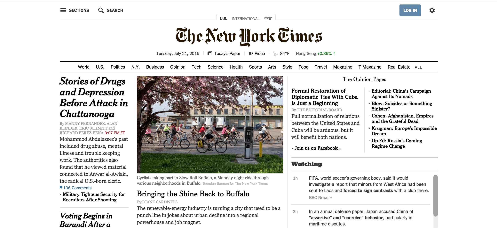
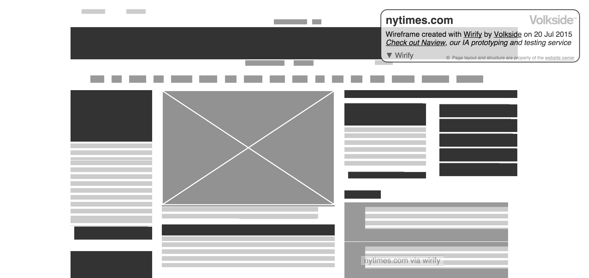
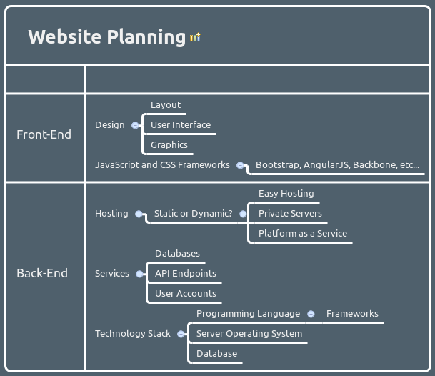

Planning an Entire Website from Front to Back
===

Here is the link to the [webcast](https://plus.google.com/events/ch9pkhnn62jkh3m6if9fom9jmf4?authkey=COzzreWN8rOubw)

## Introduction

This Webcast will answer the big questions that help guide the planning of an entire Website. At the end of this Webcast, viewers will:

* Understand the crucial components that make up a website
* Answer the big questions involved in planning out a website
* Know the technologies required in order to deliver content to the Internet user

## What is a Website?

What is a website? For most people, a website is simply a page of information that we request from the Internet. From the programmer's perspective, a website is more than just a page of information: it is a framework for delivering content to Internet users.

Therefore, a website can be thought of as a series of technologies that we orchestrate together to deliver content.

## Components of a Website

This transitions into the next logical question. What are the components of a website? What are the technologies that we orchestrate together to create a website?

The main components are: 

> HTML, CSS, User Design, JavaScript, Server Endpoints, User Authentication, Web Server administration, Domain Name Servicing, Caching, and Databases

The list can go on and on and they can be daunting to keep track of. Therefore we tend to group our technologies and other components into two main categories: Front-End and Back-End

## Front-End and Back-End

Front-End deals with what the users sees on their web browser. The components we classify as front-end such HTML, CSS, user design, color schemes, page design, and JavaScript fall under front-end. 

Back-End deals with what the users do not see such as server administration and maintenance, API Endpoints, database design, web server and user account administration.

Therefore we can put all of our specifications and components into these two big categories.

## Front-End Planning

The Front-End is where most people think about first when they are planning their website. It's the most visual component of the website and it's where everyone is familiar with the design and planning of their site. Therefore we need to think about the main questions that involve the design of a web page and what type of technology that will drive the design of the web page.

### Design

The main questions we need to ask ourself about our design is:

* What is the general layout of the site?
* What kind of content do we want to display on the site?
* What is the general user flow when a user lands on our page?
* Are there any actions we want the user to engage in on our website?
* What are the color schemes and graphics we want to add in? Do we create the graphics ourselves or will we find a graphic artist to create the graphics for us?

These are the main questions we should consider when designing our site. It's always good to start off with a sketch of what our site will look like in addition to the user flow. This is the first step in the front-end part of the website.

Let's go ahead and do a sample mockup of a site we want to make. Since HTML is basically made up of a series of boxes, it's best to try and box out our design into what's called wireframes. 

This is a key design strategy that allows us to prototype quickly and share our ideas quickly. Very roughly we want to just draw boxes to represent different components of our site. 

Suppose we want to create a New York Times clone: 



we would put boxes here to emulate the New York Times site here:



It's important to think about what we want these boxes to do and how we want the user to look at our page.

The header will generally be the first thing a user looks at, so it's important to put explanatory information here such as *NEW YORK TIMES*. The element in the dead center is next, and we'll see that the New York Times puts a relevant video for us to click in the middle of the site.

The columns on the side are right after the relevant video and show side articles. We can see that this closely resembles a real newspaper. Print media is a great place to take references from when you we are designing a website.

If it's just to display static information, we can just do a quick sketch and leave it at that. It's good to label each one of our boxes as sketch our design in order to know where to put each element later on. 

If we want to harness the full power of web and dynamically deliver content, each box is going to have to interact wih the back-end somehow. It's crucial to think about the technologies that we will use since the capabilities of each framework we use will dictate how the end result looks - it also makes planning our back-end easier as well.

#### Design Example

Suppose we have a box for a login. This is going to require some Javascript and a Form. We should also place the login in a focal point; the New York Times puts it in the top right.

If we also want to have a box for most recent popular posts, we'll need to use some database on the back-end and put it in a less important place such as the right-hand side of the newspaper. We can already start to see this come together very neatly. Hopefully this example gives us some ideas to work with in starting to design our page.

Something that we can do is shade our boxes to determine whether we'll end up putting light colors or dark colors. In general it is best to use high contrast sparingly, and it is good to group similar shades together. Once we have everything laid out, it's time to decide whether we want to design things ourself or outsource them if we have less experience in Graphic Design. There is no shame in delegating.

The wireframing stage is very useful for thinking about colors as well. Most people think that colors do not matter or they can figure it out afterwards, but it is very important to consider color at the beginning of our design because good design makes navigation easier, and use of our website more pleasant, making it more likely for your visitors to come back. 

Visual design is as important as the front-end technology.

### Front-End Technology

Once the initial designs and mockups are completed, we can explore the required technologies that can actually drive the design. The required technologies that exist today are:

* HTML (Hypertext Markup Language)
* CSS (Cascading Style Sheets)
* JavaScript

HTML helps us layout the core structure of the web site. CSS helps layout the colors, fonts, spacings, and shape of our HTML objects. JavaScript is the engine that powers a website's interactivity such as animations, AJAX requests, and HTML object manipulation.

To give an analogy, HTML is the frame of the car, CSS make up the paint, emblems, and material of the car, and JavaScript is the engine that powers the car.

#### Frameworks

There exist frameworks that make working with CSS and JavaScript easier, speeding up development time. Frameworks can be thought of as a group of functions that help automate a lot of the monotonous setup tasks that programmers must do in order to do what they actually want to do. For example, in JavaScript, in order to change the text of the 3rd paragraph of the first div element in the DOM in JavaScript, we must type this code:

```javascript
var divs = document.getElementsbyTagName('div');
var first_div = divs[0];
var third_paragraph = first_div.children[2];
third_paragraph.innerText = 'Hello World!';

```

versus using this one line command using the jQuery framework:

```javascript
$('div:first > p').slice(2,3).text('Hello World!');

```

Therefore, many programmers often ask "What frameworks are you using?" to understand how a programmer has implemented their web site. Choosing a framework is not necessary to develop the Front-End though, but frameworks make things easier for the programmer to speed up development time. Below is a list of common CSS and JavaScript frameworks used today (as of 2015):

**CSS Frameworks**

* Boostrap
* Pure CSS
* Cascade

**JavaScript Frameworks**

* AngularJS
* Knockout
* Backbone
* React
* Ember
* Meteor

Therefore when we are planning out the Front-End of our website, we first need to make decisions on the design and then figure out what Frameworks we want to use to help develop our site faster. 

Note that learning a framework does not substitute learning how to do things manually in plain CSS and JavaScript. Developers will come across situations where a framework cannot quite do what the developer wants the framework to do and will need to resort to doing things manually in plain JavaScript or CSS.

## Back-End Planning

For most people, having a static web site is satisfactory and they can simply find a simple Web host such as Wordpress or Squarespace to serve their static HTML files. But for developers, choosing a back-end is as important as designing the front-end of the web site.

### Critical Question
The first question a web developer needs to ask is:

**Will the web page provide static or dynamic content?**

The answer to this question will guide the rest of the planning process for the web server.

If the page is purely static, then choosing a back-end is easy and we can choose generic hosting servers such as Wordpress, Squarespace, Hubspot, or even Github to serve our static web pages.

If the page involves dynamic content such as a forum or a banking website, then we need to choose a back-end that will support delivering dynamic content to the user. Examples of dynamic content are user account login, storing user data in a database, and calculating new data based off dynamic input data from the user.

Once we know the answer whether we need to serve dynamic content or not, we can then move forward and address these three major questions:

* How are we going to host our server?
* What kind of services will our back-end server provide to our front-end?
* What is the technology stack?

### Server Hosting

There are many options for server hosting. Choosing the right server depends on our technical expertise, budget, and what type of content we want to deliver to the Internet user. Here are three general types of server hosting:

* **Easy Hosting**
   * Easy Hosting is an umbrella term that involves free and shared hosting where our websites live on a server that hosts other people's websites as well. This is the simplest and economical route and is ideal for static websites. Setup options are limited though. Examples of popular easy web hosting services are Wordpress, Squarespace, and GitHub.
* **Virtual Private Server and Dedicated Hosting Servers**
   * These type of servers give us full access to a whole server or a virtualized server. This is reserved for power users who need dedicated servers to serve thousands of users with dynamic and static content. The programmer is responsible for remotely installing and setting up the required software in order to run the server. A programmer would need to have server administration skills in order to fully set up the server. Companies such as Namecheap, HostGator, Amazon AWS, and Dreamhost provide this type of service.
* **Platform as a Service (PAAS)**
   *  The next generation of web hosting involve a combination of Virtual Private Server and Easy Hosting where the company will allow developers to choose what technology and software they want to install on their server and the company will take care of the rest of the details. The developer does not even need to worry about server and database administration. The PAAS service implies that the developer can focus on coding the back-end with the technology that the developer wants and not have to worry about the details of setting everything up on a server. Examples of PAAS are Google App Engine, Heroku, and Amazon Elastic Beanstalk. Here is a short video highlighting the [features of PAAS](https://youtu.be/SrwxAScdyT0) for Amazon's Elastic Beanstalk.

### Domain Name Service (DNS)

On a side note, if we want a custom domain name such as `http://www.johnsmith.me`, we need to find a domain name registration service such as Namecheap or GoDaddy to buy the rights to the domain name. We can then setup the domain name service to forward all Internet requests from www.johnsmith.me to the physical address to our hosting server. Our server hosting provider would provide us more detail instructions on how to setup the DNS server to forward to the hosting provider's servers.

### Services

Next we need to know what kind of services our server will actually provide to the front-end. Will the server deliver the static content and dynamic content or will only deliver dynamic content? 

There are basically two types of dynamic content a server can deliver:

* Deliver content taken from a database on the server or on another server to the website
* Take input data from the front-end, process the data, and then deliver output back to the front-end.

A server can deliver both of these type of dynamic content. It's important to understand what are the inputs the server takes from the Front-End and what are the outputs the server will return back to the Front-End.

### Technology Stack

This is the final category that we need to consider to plan out the server. What kind of frameworks and programming languages do we want to use? In other words, what is the full list of software that we will use to serve our users?

If the content is 100% static, then we just need to find an easy host and upload our web files. There is no need to consider our Back-End technology. Now if there is a need for dynamic content, then we need to make a choice on choosing the technologies that we want to use to help us server our dynamic content to our users.

Here is a short list of popular technologies that help us serve dynamic content:

* Programming Languages
    * Python
    * Java
    * .NET
    * Ruby
    * Node.js
    * PHP
 
 We can dive deeper into each programming language and we can find out that some programming languages will have several different frameworks to help serve our website. For example, consider three frameworks for Python to serve websites:
 
  * Django
  * Webapp2
  * Flask

Furthermore, if we need a Database, we also need to make a decision to use Relational Databases or NoSQL databases:

* Relational:
  * mySQL
  * PostgreSQL
* NoSQL
  * MongoDB
  * Hadoop
  * Cassandra

Once we decide on the type of server, technology, and database we want to use, we can then put together the whole technology stack from front to back. Here are two examples of technology stacks that we'll often see among developers:

> Linux system, Apache Web server, MySQL database, PHP/PERL/Python: otherwise known as LAMP

> MongoDB database, Express framework, AngularJS, Node.js: otherwise known as MEAN

The MEAN stack can be run on any operating system, but most developers will opt to use Linux. Also note that MEAN is a full-stack technology stack because it involves Back-End and Front-End with the inclusion of AngularJS. LAMP is a pure back-end technology stack. If we want to include AngularJS for LAMP and include the Flask framework for Python, we can be clever and make up an acronym such as FLAMPA.

## Summary

Planning out a web site involves decisions on the front-end and back-end side. For the front-end, the design of the web page needs to be addressed first. Once we figure out the design, we can then figure out the type of JavaScript and CSS framework that can help us drive the design.

For the Back-End, it's important to know whether the content we plan to serve to our users involve dynamic content or not. If it is dynamic, we then need to list out the type of dynamic content we need to serve and choose the technology stack that will allow our servers to serve our dynamic content.


